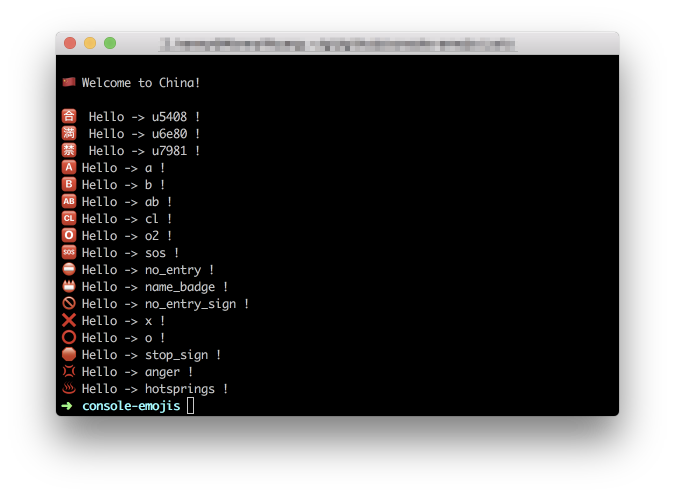

console-emojis
---

help you write better code and make debugging more fun:



## Install

```bash
npm install console-emojis
```

```js
require('console-emoji')
```

```js
import 'console-emoji';
```

## Examples

```js
// Logging to the console
console.cn(" Welcome to China!");
console.u5408(" Hello -> u5408 !")
console.u6e80(" Hello -> u6e80 !")
console.u7981(" Hello -> u7981 !")
console.a(" Hello -> a !")
console.b(" Hello -> b !")
console.ab(" Hello -> ab !")
console.cl(" Hello -> cl !")
console.o2(" Hello -> o2 !")
console.sos(" Hello -> sos !")
console.no_entry(" Hello -> no_entry !")
console.name_badge(" Hello -> name_badge !")
console.no_entry_sign(" Hello -> no_entry_sign !")
console.x(" Hello -> x !")
console.o(" Hello -> o !")
console.stop_sign(" Hello -> stop_sign !")
console.anger(" Hello -> anger !")
console.hotsprings(" Hello -> hotsprings !")

// Output
🇨🇳  Welcome to China!

🈴  Hello -> u5408 !
🈵  Hello -> u6e80 !
🈲  Hello -> u7981 !
🅰️  Hello -> a !
🅱️  Hello -> b !
🆎  Hello -> ab !
🆑  Hello -> cl !
🅾️  Hello -> o2 !
🆘  Hello -> sos !
⛔  Hello -> no_entry !
📛  Hello -> name_badge !
🚫  Hello -> no_entry_sign !
❌  Hello -> x !
⭕  Hello -> o !
🛑  Hello -> stop_sign !
💢  Hello -> anger !
♨️  Hello -> hotsprings !
```